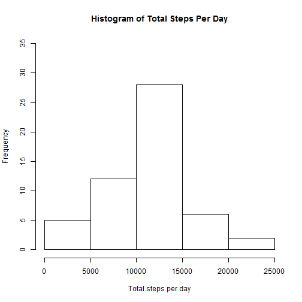
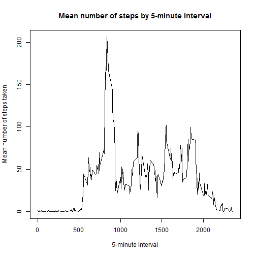
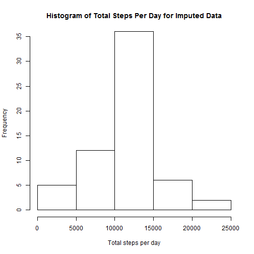
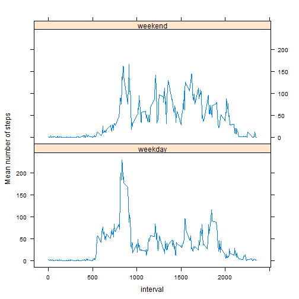

##Reproducible Research - Project 1##  
Examine data collected from a personal activity monitoring device for October and November, 2012. The device collected data at 5-minute intervals and recorded the number of steps taken during each interval.  
<br />
Load the necessary packages.


```r
library(plyr)     # Needed for ddply() and join()
library(lattice)  # Needed for xyplot()
```
<br />

Read the data file.

```r
setwd("c:/RProg/RR-proj1")   
stepData<-read.csv("activity.csv",header=TRUE)
```
<br />  

###Steps taken per day###  

Calculate the total number of steps taken on each of the 61 days and plot in a histogram.

```r
totalStepsPerDay<-ddply(stepData,~date,summarize,sum=sum(steps),na.rm=TRUE)
hist(totalStepsPerDay$sum,ylim=c(0,35),main="Histogram of Total Steps Per Day",
     xlab="Total steps per day")
```

 
<br />

Compute the mean and median of the total number of steps taken each day.

```r
cat(c("Mean of total steps per day = ",format(mean(totalStepsPerDay$sum,na.rm=TRUE),nsmall=2)))
```

```
## Mean of total steps per day =  10766.19
```

```r
cat(c("Median of total steps per day = ",format(median(totalStepsPerDay$sum,na.rm=TRUE),nsmall=2)))
```

```
## Median of total steps per day =  10765
```
<br />  

###Average daily activity pattern###  

Construct a time-series plot of the 5-minute intervals and the average number of steps taken, averaged across all days.

```r
meanStepsByInterval<-ddply(stepData,~interval,summarize,mean=mean(steps,na.rm=TRUE))
plot(mean~interval,data=meanStepsByInterval,type="l",xlab="5-minute interval",
     ylab="Mean number of steps taken",main="Mean number of steps by 5-minute interval")
```

 
<br />

Determine which 5-minute inteval contains the maximum average value.

```r
maxIndex<-which.max(meanStepsByInterval$mean)   # Find the index of the maximum mean
maxInterval<-meanStepsByInterval$interval[maxIndex]  
cat(c("The 5-minute interval with the highest mean number of steps is interval",
    maxInterval,"with average value of",
    format(meanStepsByInterval$mean[maxIndex],nsmall=2)))
```

```
## The 5-minute interval with the highest mean number of steps is interval 835 with average value of 206.1698
```
<br />

###Imputing missing values###

Calculate and report the total number of missing values in the dataset.

```r
countNA<-sum(is.na(stepData$steps))   # Count number of missing values for 'steps' variable
cat("The number of missing values for the 'steps' variable is",countNA)
```

```
## The number of missing values for the 'steps' variable is 2304
```
<br />

Create a new dataset, in which the missing values for number of steps are replaced by the mean number of steps for the given 5-minute interval.

```r
mergedData<-join(stepData,meanStepsByInterval,by="interval")
imputedData<-mergedData
imputedData$steps[is.na(mergedData$steps)]<-imputedData$mean[is.na(mergedData$steps)]
```
<br />

Compute the total number of steps per day in the imputed data set and construct a histogram.

```r
totalStepsPerDayImputed<-ddply(imputedData,~date,summarize,sum=sum(steps),na.rm=TRUE)
hist(totalStepsPerDayImputed$sum,ylim=c(0,35),main="Histogram of Total Steps Per Day for Imputed Data",xlab="Total steps per day")
```

 
<br />

Compute the mean and median of the total steps per day for the imputed data set and compare to the mean and median prior to imputation.

```r
cat("Unimputed mean:",format(mean(totalStepsPerDay$sum,na.rm=TRUE),nsmall=2),
    "   Imputed mean:",format(mean(totalStepsPerDayImputed$sum,na.rm=TRUE),nsmall=2))
```

```
## Unimputed mean: 10766.19    Imputed mean: 10766.19
```

```r
cat("Unimputed median:",format(median(totalStepsPerDay$sum,na.rm=TRUE),nsmall=2),
    "   Imputed median:",format(median(totalStepsPerDayImputed$sum,na.rm=TRUE),nsmall=2))
```

```
## Unimputed median: 10765    Imputed median: 10766.19
```
<br />

###Differences in activity patterns for weekends vs. weekdays###

Create a new factor with two levels, "weekday" and "weekend".

```r
timeOfWeek<-rep("weekday",nrow(imputedData))  # Initialize all value to 'weekday'
timeOfWeek[weekdays(as.POSIXct(imputedData$date))=="Saturday" | 
           weekdays(as.POSIXct(imputedData$date))=="Sunday"] <- "weekend"  
imputedData$partOfWeek=as.factor(timeOfWeek)    # Add the weekend/weekday variable as a factor 
```
<br />

Using the imputed data, compute mean number of steps by each 5-minute interval for weekdays and weekends and display these in a time series plot.

```r
meanStepsByIntervalImputed<-ddply(imputedData,~interval+partOfWeek,summarize,mean=mean(steps,na.rm=TRUE))
xyplot(mean~interval | partOfWeek,data=meanStepsByIntervalImputed,type="l",
       layout=c(1,2),ylab="Mean number of steps")
```

 
